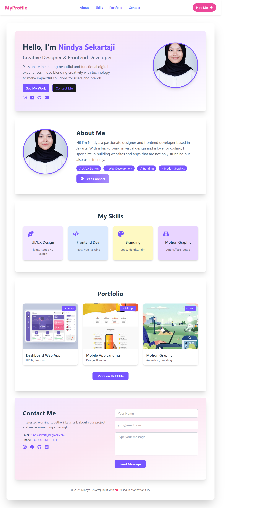
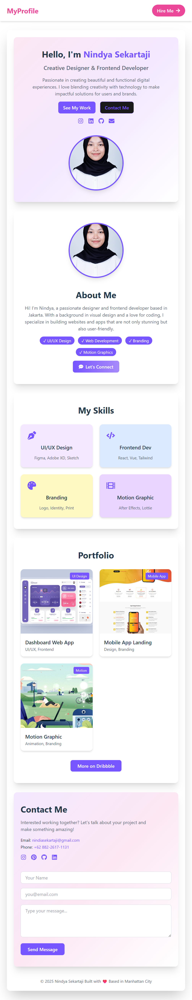

# 🌸 Nindya Sekartaji — Creative Designer & Frontend Developer

Welcome to my personal portfolio website! This project showcases my skills in UI/UX design, frontend development, branding, and motion graphics. Built with React and Tailwind CSS, the site is fully responsive and designed to reflect my aesthetic and professional identity.

---

## ✨ Features

- 🎨 Clean and responsive layout based on Figma mockup
- ⚡ Built with React + Tailwind CSS
- 📱 Mobile-first design
- 🧩 Modular components for maintainability
- 📷 Optimized image loading
- 💌 Contact form with social media integration

---

## 📁 Project Structure
src/
├── assets/
│   ├── images/        // gambar dari Figma
│   └── fonts/         // font custom jika ada
├── components/
│   ├── Navbar.js
│   ├── ProfileCard.js
│   ├── AboutSection.js
│   ├── SkillsSection.js
│   └── Footer.js
├── pages/
│   └── Home.js
├── App.js
└── index.css

---

## 🛠️ Tech Stack

- **React** — Component-based frontend framework
- **Tailwind CSS** — Utility-first styling
- **Vite** — Fast build tool
- **React Icons** — For social and skill icons

---

## 📬 Contact

Feel free to reach out or collaborate!

- 📧 Email: nindasekartaji@gmail.com  
- 📱 Phone: +62 882-2617-1131  
---

## 🧠 Credits

Built with ❤️ by Nindya Sekartaji  
Based in Manhattan City  
© 2025

---

## 🖼️ Preview

### 💻 Desktop View

### 📱 Mobile View
